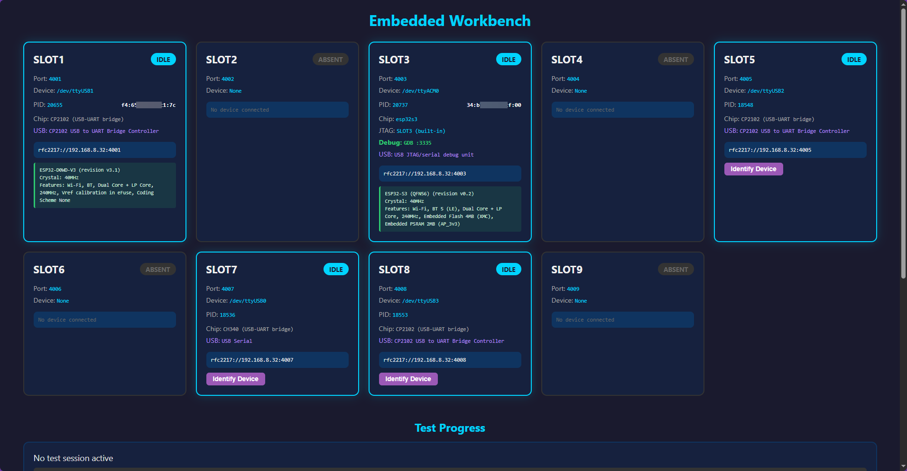

# Workbench-Bridge

**Flash and monitor a whole shelf of ESP32s that live on a Raspberry Pi — from any Windows IDE, over your network, as if each board were plugged straight into your PC.**

Workbench-Bridge is a self-contained .NET 10 Windows service that turns the network-attached serial slots of a [Universal-Embedded-Workbench](https://github.com/SensorsIot/Universal-Embedded-Workbench) (the Raspberry-Pi ESP32 lab by Andreas Spiess / SensorsIot — formerly *Universal-ESP32-Workbench*) into ordinary local **COM ports** on your machine. Pick `COM41` in the Arduino IDE, hit **Upload**, and the firmware streams over the network to the physical ESP32 sitting on the Pi — no IDE plugins, no custom drivers, no per-tool configuration.

## Why it exists

The Universal/Embedded Workbench is a brilliant way to share a rack of ESP32 / ESP8266 boards over a network via RFC 2217 (Telnet COM Port Control): wire your devices to a Pi once, and they're reachable from anywhere. The catch is the Windows side — Arduino IDE, PlatformIO, Visual Studio, PuTTY and most tools only speak to *local* COM ports and have no concept of a network serial device. (`esptool` can target `rfc2217://` directly from the command line, but the IDEs can't — and even for esptool a real COM port is simpler and works with everything.)

Workbench-Bridge closes that gap. It pairs each remote slot with a local virtual COM port (via [com0com](https://github.com/sthomas69/com0com)) and transparently relays the serial stream — **including the parts that normally break over a network**, like the ESP32 stub flasher's high-speed baud switch and the auto-reset handshake. The result: every tool that works with a COM port just works, as if the board were on your desk.



*The Pi-side portal (this fork): every slot shows live device info, and **Identify Device** reads the chip type + MAC straight from the silicon — no flashing, no firmware required. Workbench-Bridge turns each of these slots into a local Windows COM port. ([More on the portal features below.](#what-the-pi-side-brings-to-the-table))*

## Who needs this

- **Educators, YouTubers and lab owners** running a shared ESP32 bench (the Universal/Embedded Workbench use-case) who'd rather program boards from a normal Windows toolchain than SSH into the Pi.
- **Distributed / remote teams and hot-desks** — the boards stay on one Pi; anyone on the network flashes them from their own laptop, in their own IDE, at the same time.
- **Makers with a "device drawer"** — keep a dozen ESP32 variants permanently wired to a Pi and reach any of them as `COM41`–`COM49` without re-cabling.
- **Anyone fighting `rfc2217://` URLs** — point-and-click COM ports instead of fragile URL strings, and 921600-baud Arduino uploads that *actually* succeed.

## Key features

- **Transparent COM-port bridging** — RFC 2217 over com0com virtual null-modem pairs; your IDE sees `COM41`, the bridge quietly talks to the Pi.
- **High-speed flashing that works** — a SLIP-frame baud sniffer handles the ESP32 stub flasher's `CHANGE_BAUDRATE` correctly (deferred until the frame completes), so Arduino IDE uploads at **921600** — the notoriously flaky rate — succeed.
- **Smart, automatic reset handling** — classic CP2102/CH340 boards get DTR/RTS auto-reset; native-USB boards (USB-Serial-JTAG: S2/S3/C3/…) get the correct reset *synthesised*, and merely **opening a serial monitor never trips the board into the bootloader**.
- **Device-aware** — polls the Pi portal so an empty slot parks quietly (no socket-error spam) and a bridge starts the instant a board is plugged into that slot.
- **Self-healing provisioning** — creates and repairs the com0com pairs itself (no manual `setupc`, **no reboot**), and automatically re-finishes any half-completed Windows port migration.
- **Self-contained & self-installing** — a single `.exe`, no .NET runtime to install; `--install` / `--uninstall` register the background Windows service for you (self-elevating).
- **Built to operate** — a full CLI (`status`, `logs -f`, `configure`, `diagnose`, `reset-counters`, …), rolling Serilog files with per-port TX/RX counters, and named-pipe IPC so day-to-day commands never need elevation.
- **Multi-slot** — bridge as many ESP32s as the Pi exposes, each as its own COM port.

## How It Works

```
Your IDE                    Workbench-Bridge                      Pi (Embedded Workbench)
                              (Windows Service)

COM41 -----> COM241 -------> RFC 2217 Client -------> TCP:4001 --> /dev/ttyUSB0 --> ESP32
(user port)  (internal port)  (baud rate sync)        (network)    (physical serial)
  ^               ^                                                     ^
  |               |                                                     |
com0com        com0com                                           ser2net / RFC 2217
virtual pair   virtual pair
```

1. **com0com** creates a virtual null-modem pair: COM41 (what your IDE uses) and COM241 (what the bridge connects to)
2. **Workbench-Bridge** opens COM241 and establishes an RFC 2217 session to the Pi
3. Serial data flows bidirectionally between your IDE and the physical ESP32
4. Baud rate changes (including the ESP32 stub flasher's SLIP-framed CHANGE_BAUDRATE command) are detected and forwarded to the Pi via RFC 2217 negotiation

### The Deferred Baud Change

The hardest part of this project was getting Arduino IDE uploads working at 921600 baud. The ESP32 stub flasher sends a CHANGE_BAUDRATE command inside a SLIP frame, but serial reads can split that frame across multiple chunks. If you switch the Pi's baud rate before the entire frame (including the terminating 0xC0 byte) has been sent, you corrupt the stream.

Workbench-Bridge solves this with a deferred baud change state machine in `SlipBaudRateSniffer`: it extracts the target baud rate when it sees the command, but waits until the SLIP frame-end byte (0xC0) has actually been transmitted before switching the Pi to the new rate.

### What the Pi side brings to the table

Workbench-Bridge is the Windows half of a pair — the Pi runs the Universal / Embedded Workbench portal. Several portal capabilities (contributed back upstream) are what let the bridge "just work" without per-board fiddling:

- **Per-slot device identity & classification.** The portal probes each board (esptool `chip_id` / MAC read) and publishes `vid:pid`, vendor/model, chip family, the base MAC, the **transport** (`uart-bridge` vs `native-usb`), and a **reset profile** (`classic` | `usb-jtag` | `gpio`, plus boot/enable GPIOs and download-mode capability). The bridge reads this to pick the *correct* reset automatically — no `--before` overrides, no guessing per chip.
- **Proxy liveness self-heal.** Native-USB boards re-enumerate their USB device when they drop into the download bootloader, which used to strand the Pi-side proxy on a stale file descriptor (the classic "No serial data received"). The portal now detects the re-enumeration (busnum:devnum) and restarts just that slot's proxy, so the flash recovers on its own.
- **A live dashboard** showing every slot at a glance — device type, VID:PID, chip, reset method, MAC and presence (see the screenshot near the top of this README).

**What the dashboard shows:** each card is one Pi slot. The green panel and the **`Identify Device`** button are the heart of the upstream contribution. Click *Identify Device* and the portal runs `esptool` against that slot on demand — it reads the chip's identity **straight out of the silicon** (chip type and revision, crystal, flash/PSRAM, feature set — for **ESP32 and ESP8266** alike) and the board's **base MAC from eFuse**, then shows them in the green panel and next to the PID. The screenshot's SLOT3 also shows the portal recognising a native-USB part and bringing up JTAG/GDB debug automatically.

Crucially, **nothing is flashed or changed on the device.** You can plug *any* ESP32 or ESP8266 into a slot, hit Identify, and instantly know exactly what chip it is and its MAC — without programming it, erasing it, or touching your firmware. That's a genuinely useful bench capability in its own right, quite apart from Workbench-Bridge: if all you want is *"plug a board in and tell me what chip and MAC it is,"* this fork gives you that button. It's also what lets the bridge choose the correct reset/flash strategy per board, automatically.

> These features live in the **portal** (this fork), not the bridge (see [Attribution](#attribution)). `Identify` is Espressif-specific — it runs `esptool` — so a non-ESP board (e.g. a classic AVR Arduino) shows as an *unknown device*, though the bridge still exposes it as a plain COM port. Against a vanilla (non-fork) portal, Workbench-Bridge also degrades gracefully: it falls back to a device-node heuristic (`/dev/ttyACM*` → native-USB) to choose the reset method.

## Project Structure

```
Workbench-Bridge/
  Workbench-Bridge.slnx          # VS2026 solution file
  src/
    WorkbenchBridge.Rfc2217/     # RFC 2217 client, serial bridge, SLIP baud sniffer
    WorkbenchBridge.Service/     # Windows service host (Serilog, health monitoring)
    WorkbenchBridge.Cli/         # Command-line interface (IPC + direct/debug modes)
    WorkbenchBridge.Ipc/         # Named pipe protocol and client/server
    WorkbenchBridge.Tests/       # xUnit tests (SLIP sniffer + reset interceptor scenarios)
```

## Prerequisites

- **Windows 10/11** (or Windows Server 2019+)
- **.NET 10 Runtime** (or SDK for building from source)
- **[com0com](https://github.com/sthomas69/com0com) v3.0.0** for virtual COM port pairs
- **Universal / Embedded Workbench** portal running on a Raspberry Pi (ser2net / RFC 2217 + the device portal)
- **Visual Studio 2026** (for building from source; any edition)

## Setup

### 1. Install com0com (one time)

Download and install [com0com v3.0.0](https://github.com/sthomas69/com0com). No need to create pairs manually — `workbenchbridge-cli configure` does that.

### 2. Build

```powershell
dotnet build Workbench-Bridge.slnx
```

### 3. Install the Windows service (one time)

Use a published single-file build (`dotnet publish … --self-contained -p:PublishSingleFile=true`,
or a GitHub Release zip) and run its `--install`. It copies the exe (and your
`appsettings.Local.json`, if present) into `C:\Program Files\Workbench-Bridge\`, registers the service
(`LocalSystem`, delayed-auto-start) with crash-recovery actions, and starts it. The exe self-elevates,
so you can launch it from a normal shell — Windows shows the UAC prompt:

```powershell
.\Workbench-Bridge.Service.exe --install
```

`--uninstall` reverses it (stops + deletes the service). Both are the only steps that need elevation;
everything afterwards (`configure`, `status`, …) runs from the unprivileged CLI.

> Building from source instead? `sc.exe create WorkbenchBridge binPath= "<path>\Workbench-Bridge.Service.exe" start= delayed-auto` works too — `--install` just automates it.

### 4. Create your `appsettings.Local.json`

Copy the template and edit it to match your Pi's IP and how many ESP32 slots you have:

```powershell
Copy-Item src\WorkbenchBridge.Service\appsettings.Local.json.example `
          src\WorkbenchBridge.Service\appsettings.Local.json
notepad src\WorkbenchBridge.Service\appsettings.Local.json
```

This file is gitignored — your real network addresses never end up in the repo. The committed `appsettings.json` has only safe public defaults; `appsettings.Local.json` is layered on top at service startup.

Schema for one slot (repeat per ESP32):

```json
{
  "SlotLabel":  "SLOT1",
  "PiTcpPort":  4001,
  "User":       { "RegistryKey": "CNCA0", "PortName": "COM41" },
  "Internal":   { "RegistryKey": "CNCB0", "PortName": "COM241" }
}
```

- `User.PortName` — what your IDE opens (Arduino, PlatformIO, esptool, etc.)
- `Internal.PortName` — what the bridge opens
- `User.RegistryKey` / `Internal.RegistryKey` — the com0com pair-side this maps to (`CNCA{n}` / `CNCB{n}`, same `n`)
- `PiTcpPort` — RFC 2217 port on the Pi (ser2net config)

### 5. Apply config to the machine

From a **normal (non-elevated)** PowerShell:

```powershell
workbenchbridge-cli configure          # the installed CLI (Workbench-Bridge.Cli.exe)
```

The CLI reads your `appsettings.Local.json` and sends it to the running
WorkbenchBridge service over the named pipe. **The service (running as
LocalSystem) does all the privileged work** — so you do *not* need to run the
CLI elevated. The only one-time elevated step is installing the service itself
(`sc create`, step 3 above).

Inside the service, one configure request:

1. Stops the service's in-process bridges so they release the Internal COM port handles (the service does **not** stop itself)
2. For each slot missing a live PnP device, runs `setupc install <n> PortName=COM# PortName=COM#` (placeholder install — hands the device to Microsoft's Ports class installer)
3. Renames each side to your desired COM name with `setupc change CNCxn RealPortName=COMnn` — the documented method that keeps the device in the **Ports (COM & LPT)** class. A rename issued right after a reboot-required install is deferred by Windows; the service detects this (the live device name didn't change) and re-applies it on a later self-heal pass once the device is stable, so **no reboot is ever required**.
4. Strips the `serenum` upper-filter from each com0com port. serenum is the serial-mouse enumerator; on a virtual port it can mis-detect a phantom "Microsoft Serial Mouse" and (with `sermouse` enabled) inject stray cursor movement during install churn. Our ports never host a serial mouse, so it is removed.
5. Pre-releases the COM-port-database (ComDB) bits for the names being claimed so the install step never hits "name is already in use"
6. Normalises `EmuBR` / `EmuOverrun` to `REG_DWORD` (`EmuBR` on, `EmuOverrun` off — required for lossless baud-rate emulation through the virtual pair)
7. Persists your `appsettings.Local.json` into the service install folder so the config survives a reboot
8. Rebuilds and restarts its bridges against the freshly-provisioned pairs

The service also runs this reconciliation on its own — at startup and periodically — so a pair that Windows left half-migrated (e.g. in the Ports class but under an auto-assigned name) is repaired automatically, capped so it never churns endlessly.

Re-running `configure` later is idempotent — if every slot is already exposed
under the right COM name, nothing happens beyond a bridge bounce. Use
`configure --dry-run` to print the plan the service would apply without changing
anything.

> **Note:** because the heavy lifting happens in the service, the service must be
> running before you call `configure`. A freshly-installed service auto-starts
> (LocalSystem, `start= auto`) even with no slots configured, so the very first
> `configure` works out of the box.

### 6. Verify

```powershell
Get-Service WorkbenchBridge
workbenchbridge-cli pairs
Get-CimInstance Win32_SerialPort | Format-Table DeviceID, Description -AutoSize
```

Open **Device Manager → Ports (COM & LPT)** — you should see entries like:

```
com0com - serial port emulator CNCA0 (COM41)
com0com - serial port emulator CNCB0 (COM241)
...
Intel(R) Active Management Technology - SOL (COM3)
```

Under **com0com - serial port emulators** you'll also see one `com0com - bus for serial port pair emulator` entry per pair — these are bus devices that glue CNCAn ↔ CNCBn together. They're normal; they are not COM ports themselves.

Open your IDE (Arduino, PlatformIO) — COM41, COM42 etc. will be in the port dropdown. Flash an ESP32 over the network as if it were plugged in directly.

## Configuration

### File layering

| File | Committed? | Purpose |
|---|---|---|
| `src/WorkbenchBridge.Service/appsettings.json` | yes (safe public defaults) | Documents the schema; ships with the build |
| `src/WorkbenchBridge.Service/appsettings.Local.json.example` | yes | Template — copy and edit for your hardware |
| `src/WorkbenchBridge.Service/appsettings.Local.json` | **no** (gitignored) | Your real per-machine config — Pi IP, slot mappings |

At runtime the service loads `appsettings.json` then layers `appsettings.Local.json` on top via `IConfiguration.AddJsonFile(optional: true, reloadOnChange: true)`. The CLI's `configure` command copies your `Local.json` from the source tree into the service's install folder so the live service picks it up.

### CLI commands

```
workbenchbridge-cli configure                # apply Local.json via the service (no elevation)
workbenchbridge-cli configure --dry-run      # print the plan without applying it
workbenchbridge-cli reset-counters COM48     # zero one bridge's TX/RX counters (or 'all')
workbenchbridge-cli pairs                    # list com0com pairs from registry + PnP
workbenchbridge-cli list                     # list configured bridges (talks to service)
workbenchbridge-cli status                   # service health, Pi reachability, per-bridge state
workbenchbridge-cli logs -f -c COM42         # follow the log, filtered to one slot (alias: monitor)
workbenchbridge-cli discover workbench.local    # per-slot presence/state straight from the Pi portal
workbenchbridge-cli diagnose COM41           # check com0com pair / Pi / RFC 2217
workbenchbridge-cli bridge COM241 workbench.local 4001 --verbose   # standalone bridge (no service)
workbenchbridge-cli test workbench.local 4001                       # raw RFC 2217 connection test
workbenchbridge-cli discover workbench.local                        # ask Pi which devices it has
```

## Logging

Logs are written to `C:\ProgramData\Workbench-Bridge\logs\service-<date>.log` with rolling files retained for a few days. The service also logs to the console when run interactively, and writes only SCM start/stop events to the Windows Event Log (provider `WorkbenchBridge`).

Use the CLI to adjust log verbosity at runtime:

```
workbenchbridge-cli set COM41 --verbose       # enable verbose logging for a bridge
workbenchbridge-cli set COM41 --hexdump       # enable hex dump of all serial traffic
```

### Watching traffic in real time (`logs`)

The `logs` command (alias `monitor`) is a `docker logs`-style viewer over the
rolling Serilog file. It reads the files directly — no elevation, no IPC, works
whether the service runs as SYSTEM or interactively (any user can read the log
dir):

```
workbenchbridge-cli logs                       # print all entries
workbenchbridge-cli logs -n 100                # last 100 entries
workbenchbridge-cli logs -f                    # follow (stream new lines, Ctrl+C to stop)
workbenchbridge-cli logs -f -c COM42           # follow just one slot's traffic
workbenchbridge-cli logs --since 30m           # entries from the last 30 minutes
workbenchbridge-cli logs --since 2026-06-02T13:00:00Z --details
```

| Flag | Meaning |
|---|---|
| `-f`, `--follow` | Stream new lines as they are written |
| `-n`, `--tail <N\|all>` | Show the last N entries (default: all) |
| `--since <ts\|rel>` | From an ISO-8601 time (`2026-06-02T13:23:37Z`) or relative (`42m`, `2h`, `1d`, `90s`) |
| `--details` | Print the raw lines (full date, timezone, exception stack traces) |
| `-c`, `--comport <COMxx>` | Filter to one slot. Matches its user port **and** paired internal port **and** RFC2217 TCP port (resolved from `appsettings.Local.json`), so RFC2217 negotiation lines are caught too |
| `--path <file\|dir>` | Read a specific log file or directory instead of the default |

For byte-level traffic, first enable a hex dump on the bridge (`set COM41
--hexdump`, then restart that bridge) and follow it: `logs -f -c COM41`.

The `status` command complements this with a live per-bridge snapshot — state,
current baud, and TX/RX byte counters:

```
workbenchbridge-cli status
```

### Pi device awareness

The service polls the Universal / Embedded Workbench portal API
(`GET http://<pi>:<portalPort>/api/devices`) every `DiscoveryPollingIntervalSeconds`
and reconciles each bridge against the slot's authoritative `present` flag:

- **Slot has a device** → the bridge is (kept) running.
- **Slot is empty** → the bridge is parked in the `no-device` state instead of
  hammering a refused TCP port and reporting a socket error. It starts
  automatically the moment a device is plugged into that slot.
- **Portal unreachable** → `status` says so, and bridges fall back to
  best-effort connect (degraded mode).

So `status` reflects what the workbench actually sees:

```
Pi portal:       workbench.local (reachable)

Port     State        Device         Baud     TX bytes     RX bytes     Verbose  Error
COM41    running      /dev/ttyUSB0   115200   0            54           no
COM42    no-device    absent         -        0            0            no
COM47    running      /dev/ttyUSB1   115200   0            0            no
```

`discover <pi-host>` prints the raw per-slot view (presence, state, device node,
last error) straight from the portal.

### Native-USB ESP32s (`/dev/ttyACM*`)

Classic ESP32 boards talk through an onboard USB-UART chip (CP2102/CH340) and
appear on the Pi as `/dev/ttyUSB*`. These flash over the bridge exactly like a
local board — esptool's DTR/RTS reset is forwarded via RFC 2217 SET_CONTROL and
the chip drops into its ROM bootloader.

ESP32-S2/S3/C3/H2 boards driven over their **native USB** (USB-Serial-JTAG or
USB-OTG CDC) appear as `/dev/ttyACM*`. **These now flash over the bridge too** —
proven end-to-end (including across a physical slot move with no IDE change, and
with a JTAG debugger attached). Two fixes made it reliable:

- **Monitor-open no longer resets the board.** The reset interceptor treats a
  *held* DTR/RTS assertion (a serial monitor) as a no-op; only an RTS pulse that
  releases within the burst window — esptool's reset — synthesises a download
  reset. Opening PuTTY or the Arduino monitor on a usb-jtag slot leaves the board
  running.
- **The Pi self-heals USB re-enumeration.** When esptool resets such a chip into
  the download bootloader it re-enumerates its USB device, which would otherwise
  leave the Pi-side proxy holding a stale file descriptor. The portal's per-slot
  liveness check (busnum:devnum) detects the re-enumeration and restarts the proxy,
  so the RFC 2217 session recovers instead of returning `No serial data received`.

A genuinely wedged Pi proxy (rare) recovers with
`sudo systemctl restart rfc2217-portal.service`.

## Testing

```
dotnet test src/WorkbenchBridge.Tests/
```

The test suite covers the SLIP baud rate sniffer (split reads, deferred baud changes, SLIP escaping, Arduino IDE's characteristic 3-read pattern, real-world byte sequences) and the ESP32 reset interceptor (monitor-held vs. esptool-pulse discrimination).

## Attribution

This project builds on top of the excellent [Universal-Embedded-Workbench](https://github.com/SensorsIot/Universal-Embedded-Workbench) (formerly *Universal-ESP32-Workbench*) by **Andreas Spiess** / [SensorsIot](https://github.com/SensorsIot). The Workbench provides the Pi-side infrastructure — ser2net, RFC 2217 serving, the device-management portal, per-slot device identity and reset profiles — that makes remote ESP32 access possible. Workbench-Bridge is the Windows-side companion that completes the picture by making those remote devices appear as local COM ports. The device-identity, reset-profile and proxy-liveness portal features described above were contributed back upstream.

## Licence

[MIT](LICENSE)
